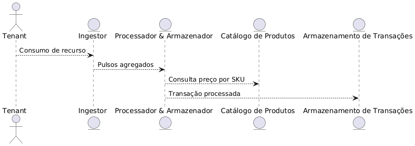
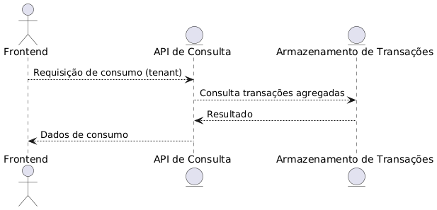

# Backend Engineer Challenge - API Challenge MagaluCloud

### Ferramentas Utilizadas

- **Golang** (>= 1.22) - Testes e desenvolvimento
- **MongoDB** (>= 2.6.10) - Testes e desenvolvimento
- **Docker** (>= 17.03.2-ce) - Desenvolvimento e produção
- **Redis** (>= 3.0.6) - Desenvolvimento e produção
- **Nginx** (>= 1.0.15) - Produção

### Estrutura de Diretórios

- **/cmd**: Contém o arquivo principal (`main.go`) para execução das chamadas de métodos e testes de conexão.
- **/pkg/api/model**: Contém os arquivos `tenant.go` e `transaction.go` com as structs usadas no projeto.

### Rotas Principais

Definidas no arquivo: `/router/routes.go`

| Método | Endpoint                                      | Descrição                                      |
|--------|-----------------------------------------------|------------------------------------------------|
| POST   | `/pulses`                                     | Cria um novo pulse                             |
| GET    | `/tenants/{tenant}/sku/{sku}/consumption`     | Obtém consumo do mês atual de um SKU           |
| GET    | `/tenants/{tenant}/consumption`               | Obtém consumo de todos os recursos de um tenant|
| POST   | `/transactions`                               | Cria uma nova transação                        |
| POST   | `/payment`                                    | Executa um pagamento                           |
| POST   | `/tenants`                                    | Cria um novo tenant                            |
| GET    | `/tenants/{id}`                               | Busca tenant por ID                            |
| POST   | `/products`                                   | Cria um novo produto                           |
| GET    | `/products/{id}`                              | Busca produto por ID                           |
| POST   | `/contracts`                                  | Cria um novo contrato                          |
| GET    | `/contracts/{id}`                             | Busca contrato por ID                          |
| GET    | `/health`                                     | Healthcheck da aplicação                       |
| GET    | `/swagger/index.html`                         | Documentação Swagger da API                    |


### Integração com MongoDB
- **/pkg/api/ingestor**: Contém o sistema de ingestão de pulsos de consumo.

- **/util/mg/mongo.go**: Usa o pacote `"go.mongodb.org/mongo-driver/mongo"` para conexão com o banco de dados.


### Controladores

- **/controller/tenantController.go**:
  - `CreateTenant()`: Criação de uma nova conta.
  - `GetTenant()`: Busca uma conta pelo ID.

- **/controller/productController.go**:
  - `CreateProduct()`: Criação de um novo produto.
  - `GetProduct()`: Busca um produto pelo ID.

- **/controller/contractController.go**:
  - `CreateContract()`: Criação de um novo contrato.
  - `GetContract()`: Busca um contrato pelo ID.

- **/controller/transactionController.go**:
  - `CreateTransaction()`: Criação de uma nova transação.
  - `BalancePayment()`: Efetuar pagamento/balanceamento de crédito.

- **/controller/pulseController.go**:
  - `CreatePulse()`: Criação de um novo pulso de consumo.
  - `GetCurrentMonthConsumption()`: Retorna o consumo atual de um SKU específico de um tenant.
  - `GetAllResourcesConsumption()`: Retorna o consumo total de todos os recursos de um tenant.

- **/controller/healthController.go**:
  - `Healthcheck()`: Verifica o status de saúde da API.


#### Com Docker Compose


### Executando o Projeto

#### Com Docker Compose

- Para desenvolvimento: `docker-compose up`
- Para produção: `docker-compose -f docker-compose-prod.yml up`

#### Manualmente

Requisitos: Banco de dados MongoDB em execução.

1. Compile o projeto: `go build ./cmd/main.go`
2. Execute o binário: `./main`

### Testes

Para rodar os testes automatizados:

- Execute na raiz do projeto: `go test ./...`

---

### Fluxo de Dados

- Ingestão, Processamento e Armazenamento



- Consulta via API



### Exemplos de Uso da API
- Execute na raiz do projeto: `go test ./...`


**POST** `/tenants`

- **Request Body**:
  ```json
  {
    "document_number": "12345678900"
  }
  ```

---

#### Buscar Informações de uma Conta

**GET** `/tenants/{tenantId}`

- **Response Body**:
  ```json
  {
    "tenant_id": "66f9ac2a1b1586137fa1561b",
    "document_number": "12345678900"
  }
  ```

---

#### Criar um Produto

**POST** `/products`

- **Request Body**:
  ```json
  {
    "sku": "sku123",
    "name": "Produto Teste",
    "limit": 500.0
  }
  ```

---

#### Buscar Informações de um Produto

**GET** `/products/{id}`

- **Response Body**:
  ```json
  {
    "sku": "sku123",
    "name": "Produto Teste",
    "limit": 500.0
  }
  ```

---

#### Criar um Contrato

**POST** `/contracts`

- **Request Body**:
  ```json
  {
    "tenant_id": "66f9ac2a1b1586137fa1561b",
    "sku": "sku123",
    "limit": 1000.0
  }
  ```

---

#### Buscar um Contrato

**GET** `/contracts/{id}`

- **Response Body**:
  ```json
  {
    "tenant_id": "66f9ac2a1b1586137fa1561b",
    "sku": "sku123",
    "limit": 1000.0
  }
  ```

---

#### Criar uma Transação

**POST** `/transactions`

- **Request Body**:
  ```json
  {
    "tenant_id": "66f9ac2a1b1586137fa1561b",
    "operation_type_id": 4,
    "amount": 123.45
  }
  ```

---

#### Pagamento

**POST** `/payment`

- **Request Body**:
  ```json
  {
    "tenant_id": "66f9ac2a1b1586137fa1561b",
    "operation_type_id": 4,
    "amount": 123.45
  }
  ```

---

#### Criar um Pulso de Consumo

**POST** `/pulses`

- **Request Body**:
  ```json
  {
    "tenant": "tenant1",
    "product_sku": "sku1",
    "used_amount": 100.0,
    "use_unity": "GB"
  }
  ```

---

#### Obter Consumo do Mês Atual (SKU Específico)

**GET** `/tenants/{tenant}/sku/{sku}/consumption`

- **Response Body**:
  ```json
  {
    "sku": "sku1",
    "consumption": 100.5
  }
  ```

---

#### Obter Consumo Total por Tenant

**GET** `/tenants/{tenant}/consumption`

- **Response Body**:
  ```json
  {
    "resource1": 200.0,
    "resource2": 150.5
  }
  ```


#### Criar uma Conta

**POST** `/tenants`

- **Request Body**:
  ```json
  {
    "document_number": "12345678900"
  }
  ```

#### Buscar Informações de uma Conta

**GET** `/tenants/:tenantId`

- **Response Body**:
  ```json
  {
    "tenant_id": "66f9ac2a1b1586137fa1561b",
    "document_number": "12345678900"
  }
  ```

#### Criar uma Transação

**POST** `/transactions`

- **Request Body**:
  ```json
  {
    "tenant_id": "66f9ac2a1b1586137fa1561b",
    "operation_type_id": 4,
    "amount": 123.45
  }
  ```

#### Pagamento

**POST** `/payment`

- **Request Body**:
  ```json
  {
    "tenant_id": "66f9ac2a1b1586137fa1561b",
    "operation_type_id": 4,
    "amount": 123.45
  }
  ```


# Especificações
go version 22 linux/amd64

Mongo

Sistema Operacional: linux Ubuntu 18.4
Sistema Operacional: linux Ubuntu 18.4

# Importações
`go build ./...`

### Swagger Documentation

Disponível em: `{{URL}}:{{PORT}}/swagger/index.html`

- **/pkg/api/ingestor**: Contém o sistema de ingestão de pulsos de consumo.

### Rotas Principais
# Contatos
# Contatos
thg.mnzs@gmail.com
